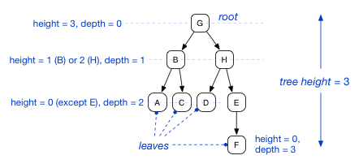
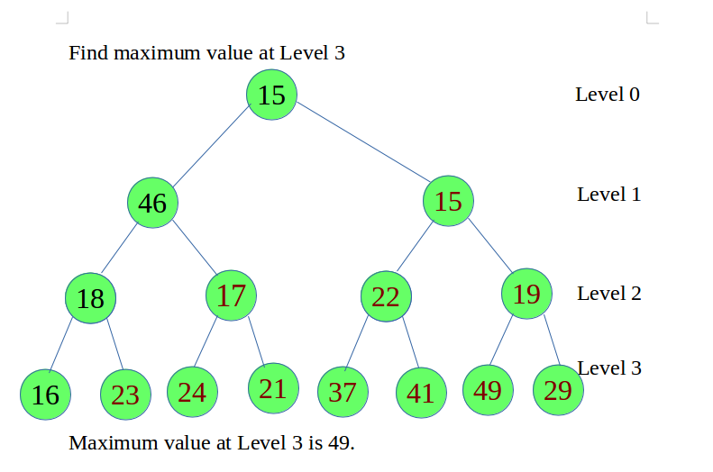

## Trees:

#### Traversal

- Depth First Traversals:

- (a) Inorder (Left, Root, Right) : 

- (b) Preorder (Root, Left, Right) : 

- (c) Postorder (Left, Right, Root) : 

#### Height and Depth of a Tree:

**Finding Height of a Binary Tree:**

- Logic: 

1. **If:** the root node is None return -1 as the height starts from zero

2. **Else:** Using recursive call find-max of left root node and right root node and add 1

`
def height(root):
    if root is None:
        return -1
    return max(height(root.left), height(root.right)) + 1

print("Height of the given tree is:",height(tree.root))
`

**Reference**: [Educative.io Binary tree height](https://www.educative.io/edpresso/how-to-find-the-height-of-a-binary-tree)

#### Level of a tree:

<!-- **************************************** -->

#### References:

1. [Programmiz-Trees](https://www.programiz.com/dsa/trees)

2. [Tree-Traversal](https://www.geeksforgeeks.org/tree-traversals-inorder-preorder-and-postorder/) 

3. [Types-of-trees](https://www.educba.com/types-of-trees-in-data-structure/)